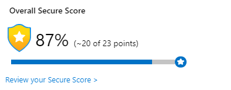

**Hi and welcome to my guide on optimizing Azure Security Center to reflect your architectural and business decisions.**
## What is Security Center?

Security Center mimics the work of a security analyst, reviewing your security recommendations, and applying advanced algorithms to determine how crucial each recommendation is to your Azure environment.

Overall Secure Score is an accumulation of all your recommendation scores and is visible on the overview page of Security Center.

{: .mx-auto.d-block :}
Recommendations can be categorized and sorted by criticality. You will also see the % of Secure Score you will gain if the recommendations are remediated.