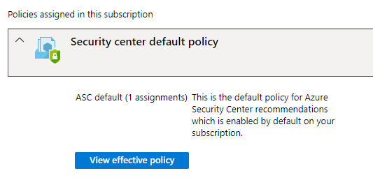
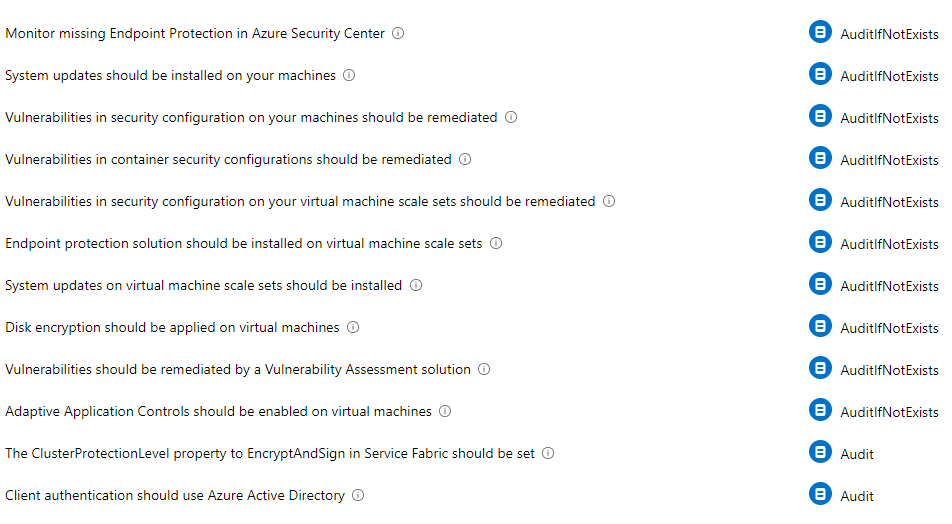
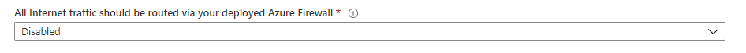

**Hi and welcome to my guide on optimizing Azure Security Center to reflect your architectural and business decisions.**
## What is Security Center?

Security Center mimics the work of a security analyst, reviewing your security recommendations, and applying advanced algorithms to determine how crucial each recommendation is to your Azure environment.

Overall Secure Score is an accumulation of all your recommendation scores and is visible on the overview page of Security Center.

{: .mx-auto.d-block :}
Recommendations can be categorized and sorted by criticality. You will also see the % of Secure Score you will gain if the recommendations are remediated.

## Default ASC Policy
Security Center fetches the compliancy rating of a resource by using Azure Policy. By default when you enable Security Center a policy with name: ASC Default will be created.
{: .mx-auto.d-block :}
When you click on ‘View effective policy’ you can see all of the security policies that are assessed and displayed in Security Center.
{: .mx-auto.d-block :}
The interesting part is the Effects on the right side.

Some policies have a ‘AuditIfNotExists‘ effect, others just have the ‘Audit‘ effect. As these are a baseline set of policies, not all of them apply to your Azure Environment. That is why we can disable policies individually in the ASC Default policy assignment.
For instance in this environment we are not using an Azure Firewall to route internet Traffic.

We can set the policy effect of policy: ‘All internet traffic should be routed via your deployed Azure Firewall’ to ‘Disabled‘. This will remove the recommendation from Security Center and the recommendation won’t affect your Secure Score. It may take some time to reflect in Security Center, as policies are not evaluated continuously.
{: .mx-auto.d-block :}
Other policies like the usage of Just In Time or NSG’s can also be disabled if you are not using them.

If you apply this principle to all of the policies, and make sure only the ones that are relevant to the environment are enabled, you will have a Secure Score that reflects reality.

## Custom Policies & Initiatives
In addition to the default ASC policy that is assigned on creation or enablement of Azure Security Center, you can integrate your custom policy assignment.
{: .mx-auto.d-block :}
This can be interesting if you have business-specific governance related policies: