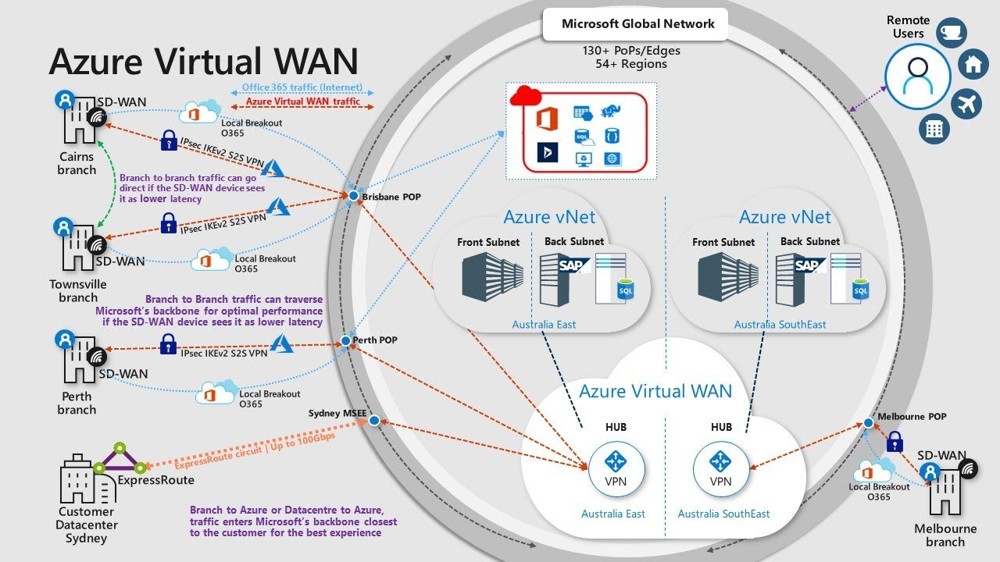
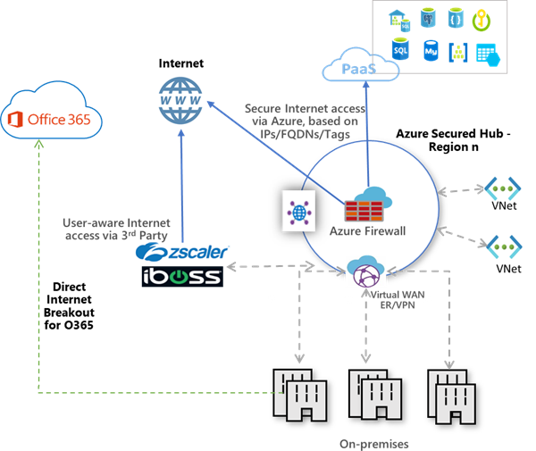
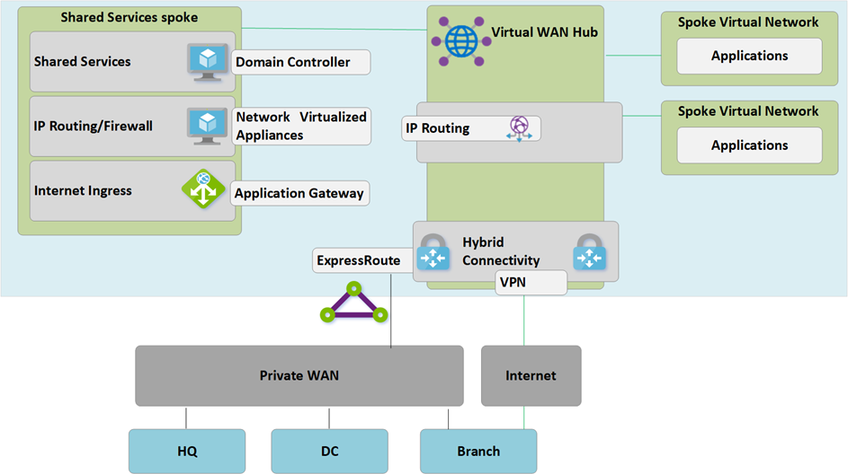

## What is Azure Virtual WAN?

Azure Virtual WAN is a networking service that provides optimized and automated connectivity through and towards Azure.
* Connect any number of branches with multiple connections
* Auto provisioning from branch office to Azure
* Automated configuration download and connection enablement
* Built for throughput and scalability
* Unified monitoring and management CPE branch devices managed by a growing ecosystem of SD-WAN and VPN partners

{: .mx-auto.d-block :}

## Virtual WAN Resources
**VirtualWAN:** The virtualWAN resource represents a virtual overlay of your Azure network and is a collection of multiple resources. It contains links to all your virtual hubs that you would like to have within the virtual WAN. Virtual WAN resources are isolated from each other and cannot contain a common hub. Virtual Hubs across Virtual WAN do not communicate with each other. The ‘Allow branch to branch traffic’ property enables traffic between VPN & ExpressRoute sites as well as VPN to ExpressRoute enabled Sites.

**Site**: The site resource known as vpnsite represents your on-premises VPN device and its settings. By working with a Virtual WAN partner, you have a built-in solution to automatically export this information to Azure.

**Hub:** A virtual hub is a Microsoft-managed virtual network. The hub contains various service endpoints to enable connectivity from your on-premises network (vpnsite). The hub is the core of your network in a region. There can only be one hub per Azure region. When you create a hub using Azure portal, it creates a virtual hub VNet and a virtual hub vpngateway.

*A hub gateway is not the same as a virtual network gateway that you use for ExpressRoute and VPN Gateway. For example, when using Virtual WAN, you don’t create a Site-to-Site connection from your on-premises site directly to your VNet. Instead, you create a Site-to-Site connection to the hub. The traffic always goes through the hub gateway. This means that your VNets do not need their own virtual network gateway. Virtual WAN lets your VNets take advantage of scaling easily through the virtual hub and the virtual hub gateway.*

**Hub virtual network connection:** The Hub virtual network connection resource is used to connect the hub seamlessly to your virtual network. At this time, you can only connect to virtual networks that are within the same hub region.

**Hub route table:** You can create a virtual hub route and apply the route to the virtual hub route table. You can apply multiple routes to the virtual hub route table. (This is going to be replaced soon)

## Global Connectivity

{: .mx-auto.d-block :}

**Azure Firewall (or other NVA):** Takes care of the Inter-spoke traffic and routing. Provides cross premises traffic shaping and handles the traffic to PaaS Services.

**3rd Party Solution (User WAN):** Takes care of the traffic towards SaaS and provides an user-aware layer (CASB principles).

**3rd Party Solution (on-prem):** Takes care of the traffic towards Azure / Saas and provides branch connectivity.

## Brownfield Migration methodology
High level overview
1. Deployment of the Virtual WAN resource
2. Deployment of (secure) vHubs for each nominated Azure Region
3. Validation of vHub to vHub connections
4. Remote site integration (3rd party solution)
5. Validation of remote sites connections
6. Demote Hub to Shared services spoke
7. Cutover to the Virtual WAN environment

{: .mx-auto.d-block :}