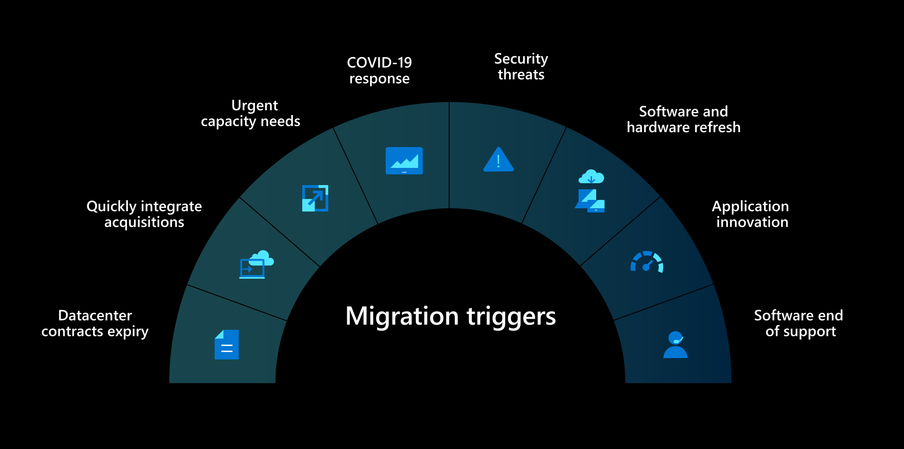

## Cloud migration insights and best practices
I had the amazing opportunity to be a speaker at the MS Inspire Virtual Event 2020. Together with the Fast Track for Azure team I've talked about best practices, migration drivers, and caveats during a cloud migration project.

{: .mx-auto.d-block :}

The video for the on demand session is now available on the Microsoft Inspire Partner Zone. It has turned out great!!

<https://www.microsoft.com/azure/partners/videos/cloud-migration-insights-and-best-practices>

