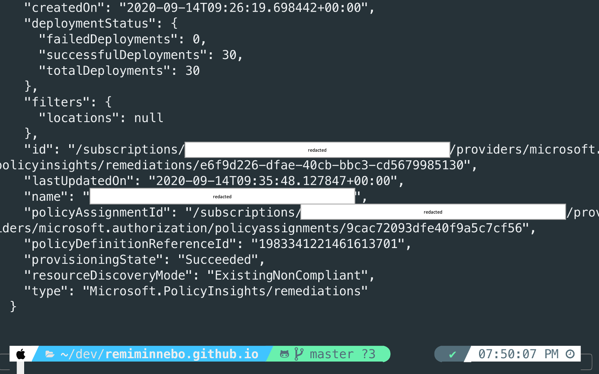
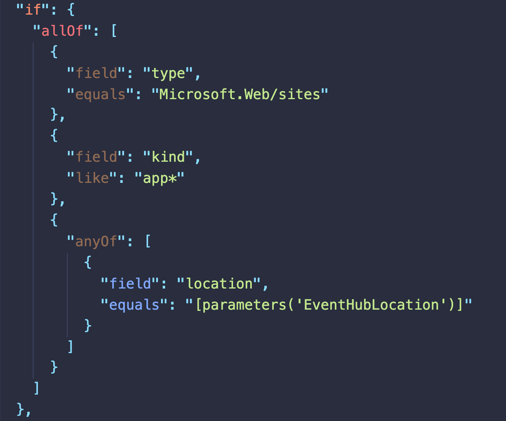
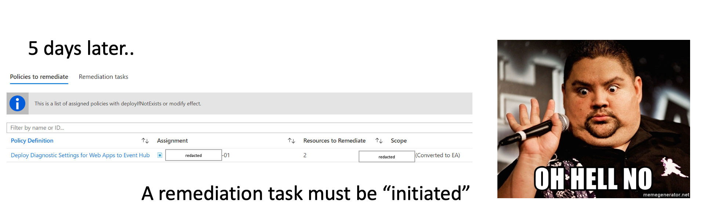
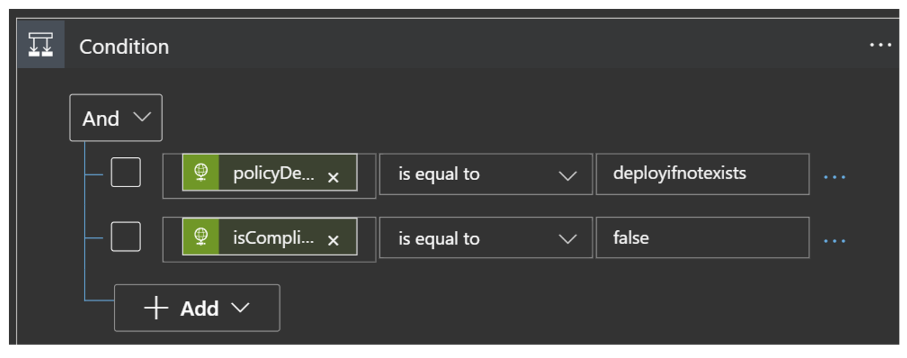
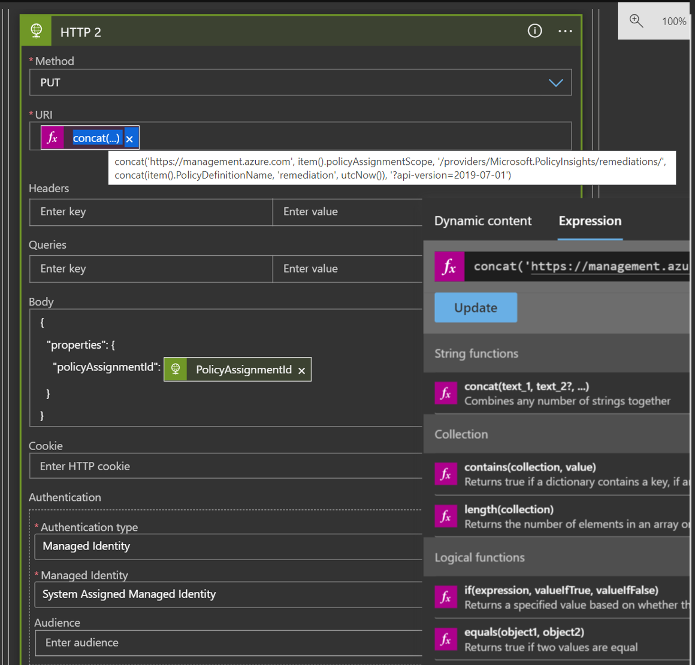
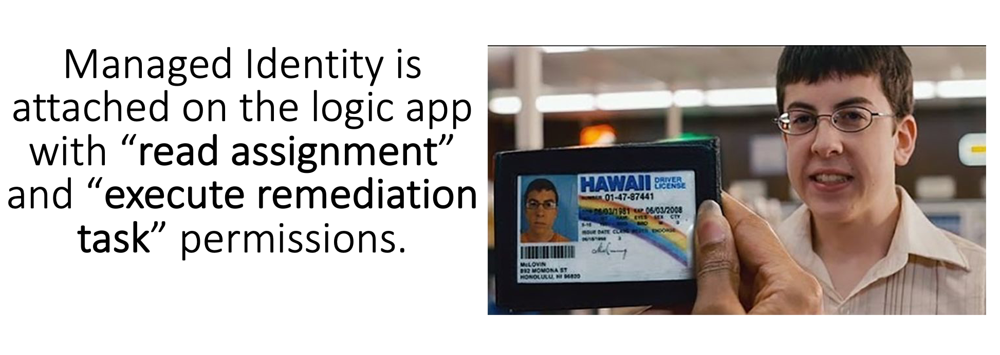

In this post I'm taking you through an automation setup that initiates remediation tasks for Azure Policy non-compliant resources in Azure. This is a setup that Jan De Laet and myself created for making our lives easier.

{: .mx-auto.d-block :}


# What is Azure policy?

Azure Policy is a service in Azure which allows you create polices which enforce and control the properties of a resource. When these policies are used they enforce different rules and effects over your resources, so those resources stay compliant with your IT governance standards.

### What does deployIfNotExists really mean?

**DeployIfNotExists** runs about 15 minutes after a Resource Provider has handled a **create** or **update** resource request and has returned a **success** status code. A template deployment occurs if there are no related resources or if the resources defined by ExistenceCondition don't evaluate to **true**.

During an evaluation cycle, policy definitions with a DeployIfNotExists effect that match resources are marked as non-compliant, but no action is taken on that resource. Existing non-compliant resources can be remediated with a remediation task.

## Lets try it out!

I deployed a custom Azure Policy that configures a Diagnostic setting on all Azure Web Apps. There are 30 Web Apps on the subscription so I had to run a remediation task to get the Azure Policy to apply to the non-compliant resources as these are "Existing" resources.

### To do this via Azure cli:

> **az policy remediation -n** *remediateallthethings* **--policy-assignment** *"/subscriptions/subid/providers/Microsoft.Authorization/policyAssignments/yourassignmentid"*



This is how it looks like in the Azure portal:

{: .mx-auto.d-block :}

Everything seems good! Let's see what happens over the next few days when we add some **new** Web Apps.

I have created 2 Web Apps about 3 days after the policy was assigned.
Remember, this policy will only apply a diagnostic setting if it is not already configured. 

{: .mx-auto.d-block :}


{: .mx-auto.d-block :}

The 2 newly added Web Apps are still in non-compliant state.

<!-- ```json
"if": {
        "allOf": [
          {
            "field": "type",
            "equals": "Microsoft.Web/sites"
          },
          {
            "field": "kind",
            "like": "app*"
          },
          {
            "anyOf": [
              {
                "field": "location",
                "equals": "[parameters('EventHubLocation')]"
              }
            ]
          }
        ]
        ....
``` -->

So let's automate this by using a Azure integration service called Logic Apps:

{: .mx-auto.d-block :}

In Logic Apps on a specific trigger (This can be on a schedule or triggered from a http request), runs a task for each **PolicyDefinitionAction** of effect **"deployIfNotExists"** or **"Modify"** that is **non-compliant**.

For every resource in the response, the logic app will loop and send out a HTTP PUT operation on the Azure Management Rest API to initiate a remediation task.
```
PUT https://management.azure.com/{resourceId}/providers/Microsoft.PolicyInsights/remediations/{remediationName}?api-version=2019-07-01
```

{: .mx-auto.d-block :}

As you can see from an 
### Identity Perspective

**Insert mandatory McLovin pic**
{: .mx-auto.d-block :}

You can trigger this Logic App action on a time interval, let's say 1 hour. Until all of your **pre-existing**, or **glitched out** non-compliant resources are remediated.
After the operation has completed, you could pass over the output/body of the HTTP response to another step in Logic Apps.
You could send a mail with a template message that takes the HTTP body output variable to notify IT teams of actions taken.
Automating things is important, but monitoring your automation is even more important!

