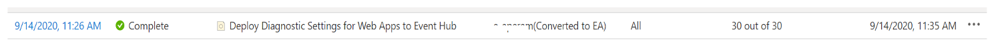

{: .mx-auto.d-block :}

# What does deployIfNotExists really mean?

**DeployIfNotExists** runs about 15 minutes after a Resource Provider has handled a **create** or **update** resource request and has returned a **success** status code. A template deployment occurs if there are no related resources or if the resources defined by ExistenceCondition don't evaluate to **true**.

During an evaluation cycle, policy definitions with a DeployIfNotExists effect that match resources are marked as non-compliant, but no action is taken on that resource. Existing non-compliant resources can be remediated with a remediation task.

#Lets try it out!

So I deployed a custom Azure Policy that configures a Diagnostic setting on all Azure Web Apps. There are 30 Web Apps on the subscription so I had to run a remediation task to get the Azure Policy to apply to the non-compliant resources as these are "Existing" resources.

To do this via Azure cli:

>**az policy remediation -n** *remediateallthethings* **--policy-assignment** *"/subscriptions/subid/providers/Microsoft.Authorization/policyAssignments/yourassignmentid"*


This is how it looks like in the Azure portal:
{: .mx-auto.d-block :}
Everything is looking good! Let's see what happens over the next few days, if we add some Web Apps.


I have created 2x Web Apps about 3 days after the policy was assigned.
Remember, this policy will only apply a diagnostic setting if it is not already configured. 

{: .mx-auto.d-block :}


{: .mx-auto.d-block :}
The 2 newly added Web Apps are still in non-compliant state.

<!-- ```json
"if": {
        "allOf": [
          {
            "field": "type",
            "equals": "Microsoft.Web/sites"
          },
          {
            "field": "kind",
            "like": "app*"
          },
          {
            "anyOf": [
              {
                "field": "location",
                "equals": "[parameters('EventHubLocation')]"
              }
            ]
          }
        ]
        ....
``` -->